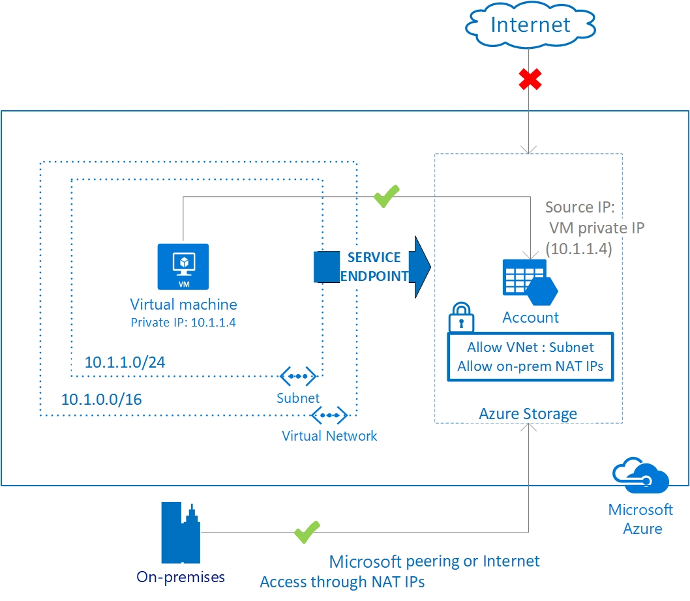
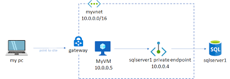

# Connecting to Storage
## Network Security
### Connection Types
- Public Endpoint - Internet Facing:
    - Easiest way to establish internet connectivity but most dangerous as you are open to any attempts from the internet
    - Proper firewall settings are critical for Public Endpoint service
- Service Endpoint on the Virtual Network:
    - Can configure firewall to limit access
    - Endpoints allow you to secure your critical Azure service resources to only your virtual networks. Service Endpoints enables private IP addresses in the VNet to reach the endpoint of an Azure service without needing a public IP address on the VNet.

- Private Endpoint inside the VNET (Virtual Network):
    - Enabled by private link, a private IP inside your VNET
    - A private endpoint is a network interface that uses a private IP address from your virtual network. This network interface connects you privately and securely to a service powered by Azure Private Link. By enabling a private endpoint, you're bringing the service into your virtual network.
    - Don't need firewall

- Internal VNET Endpoint- resource is inside the VNET
    -  Similar to above but inside VN
    - Azure service inside network, not service endpoint

### Troubleshooting Network
- Verify if your service has a Public Service, Private or VNET endpoint
- Verify that your client machine is added to any firewall or network security rules.
- If it's Service, Private or VNET Endpoint, verify that the client is part of the VNET
- If it is a Service Enpoint, verify that the VNET is allowed on the service
- If it's Private Endpoint, verify there is valid path and authorization
- Verify no local firewall is blocking your access

## Resource Names
### Different Service Names
- Storage URLs- https://*****.core.windows.net/
- SQL- TCP: *****.database.windows.net, port 1433
- Redis Cache- TCP: *****.redic.cache.windows.net, port 6380

### Troubleshooting Names
- Verify you have the correct resource name, including case sensitivity
- Verify you have the correct port and protocol

## Authentication and Authorization
- Authentication: validate your identity to the service using a set of credentials
    - e.g Azure active Directory account or SQL database username and password

- Authorization: after being authenticated, the service allows you to perform a specific set of actions based on your identity

- Keys and Tokens: merge authentication and authorization in one credential: not tied uniquely to one person but the fact that you hold them means you can use them.

### Troubleshooting Authentication and Authorization
- Verify you have the correct type of credential
- Verify you have the valid credentials
- Verify you have been given the proper permissions
